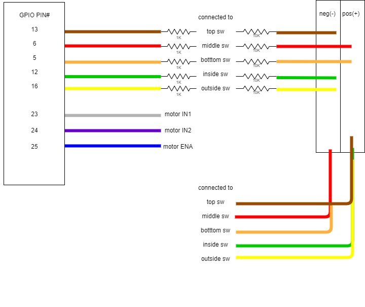
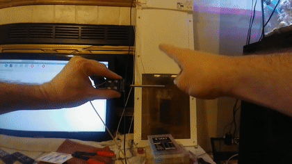

# pi-dog-door
ai auth pi dog door 
a pretty simple open and shut case

much TODO
# Setup hardware
```
sudo raspi-config
 select Interfacing Options
 select Camera
 select Enable
 Exit and restart

sudo modprobe bcm2835-v4l2
v4l2-ctl --overlay=1
v4l2-ctl --overlay=0
```

# Setup Software
```shell
sudo apt-get update
sudo apt-get upgrade
sudo apt-get remove --purge libreoffice* wolfram-engine
sudo apt-get clean
sudo apt-get autoremove
sudo rpi-update
sudo apt-get install build-essential cmake pkg-config libjpeg-dev \
 libtiff5-dev libjasper-dev libpng-dev libavcodec-dev libavformat-dev \
 libswscale-dev libv4l-dev libxvidcore-dev libx264-dev libgtk2.0-dev \
 libgtk-3-dev libatlas-base-dev gfortran dh-make
sudo pip3 install adafruit_blinka board imutils numpy
cd ~
wget -O opencv.zip https://codeload.github.com/opencv/opencv/zip/3.4.9
wget -O opencv_contrib.zip https://codeload.github.com/opencv/opencv_contrib/zip/3.4.9
unzip opencv.zip
unzip opencv_contrib.zip

sudo nano /etc/dphys-swapfile
 change CONF_SWAPSIZE=100
 to CONF_SWAPSIZE=1024
sudo service dphys-swapfile restart

cd ~/opencv-3.4.9/
mkdir build
cd build
cmake -D CMAKE_BUILD_TYPE=RELEASE \
 -D CMAKE_INSTALL_PREFIX=/usr/local \
 -D INSTALL_PYTHON_EXAMPLES=ON \
 -D OPENCV_EXTRA_MODULES_PATH=~/opencv_contrib-3.4.9/modules \
 -D ENABLE_PRECOMPILED_HEADERS=OFF \
 -D BUILD_EXAMPLES=ON ..

make -j4
sudo make install
sudo ldconfig

sudo nano /etc/dphys-swapfile
 change CONF_SWAPSIZE=1024
 to CONF_SWAPSIZE=100
sudo service dphys-swapfile restart
```

# Test Software install
```python
import cv2
cv2.__version__
```


#Media Section





